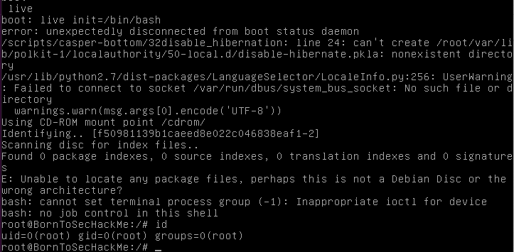

# root on boot

every linux susbsystem has a recovery mode available by pressing a key/keys on boot.

On this machine it is `esc`

we acces recovery mode or 'grub mode'

here we technically are already root, but let's open a shell.

we can only use command `live`.

`live` alone starts the machine normally, with `init=/bin/bash` you tell it what to starts with.

